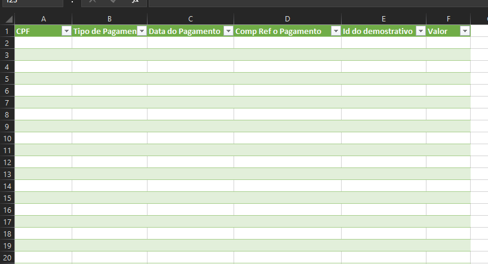

# E-Social Inclusão 1210 

## Introdução 

Seja bem-vindo ao repositório dedicado à automação do sistema de gestão de folhas de pagamento e à inserção de informações no Sistema do E-Social. Este script é parte integrante de uma série de ferramentas desenvolvidas para automatizar processos na plataforma do E-Social.
Embora a ideia inicial envolvesse a possível integração com o Framework do BotCity para potencializar a automação, essa estratégia não avançou conforme planejado devido a orientações do solicitante. No entanto, este script foi desenvolvido independentemente, mantendo seu propósito central de oferecer uma solução eficaz para a inserção de informações no Sistema do E-Social.
A proposta inicial era desenvolver um conector utilizando o serviço Web Service(SOUP) do sistema, porém, infelizmente o projeto não foi para frente.
A intenção de disponibilizar este projeto é mostrar um pouco do meu trabalho. Mesmo que o que tenha sido desenvolvido seja algo simples e mesmo que eu acredite que não tenha utilizado as melhores ferramentas disponíveis, foi possível criar algo útil que atendeu às necessidades dos solicitantes.

## Visão Geral

Os scripts que desenvolvi para essas automações atendem a situações bastante específicas e podem não ser aplicáveis em todos os casos.
O script é bastante simples, sendo praticamente 99% desenvolvido em Python, com algumas funções em JavaScript para interagir com elementos específicos das páginas. Em sua essência, utilizamos o Selenium para interagir com os elementos do navegador e o OpenCV para lidar com as janelas do Java.
Recebi solicitação para criar versões destinadas a três tipos diferentes de certificados:
    *   Certificados A1;
    *   Certificados A3 para Pessoa Física com procuração para as empresas;
    *   Certificados A3 para Pessoa Jurídica (PJ).

## Instalação

Embora eu acredite que este script pode não ser aplicável em todos os cenários, aqui estão as instruções para sua instalação:
1. Clonar o repositório
Clone este repositório em seu ambiente local usando o seguinte comando no terminal:

        git clone https://github.com/evertonmsimoes/Inclusao1210_E-Social.git

2. Configurar o ambiente
Certifique-se de ter o Python instalado. Se ainda não tiver, você pode baixá-lo em Python.org.

3. Instalar dependências
Navegue até o diretório do projeto e instale as dependências necessárias usando o gerenciador de pacotes Python, pip. Execute:
    pip install -r requirements.txt

## Uso

O funcionamento do script é simples: ao executá-lo, será solicitada a inserção de algumas informações. Estas variam de acordo com o tipo de script e incluem o ano e mês, nessa ordem, escritos sem a utilização de caracteres especiais, como por exemplo: '/', '|', '-'.
Além disso, será requisitada a senha para certificados do tipo A3 e o CNPJ para certificados do tipo A3 PF.
Para utilizá-lo, é necessário realizar a configuração da pasta de imagens, permitindo que o script reconheça as telas do seu notebook. Igualmente importante é ter uma pasta contendo a planilha que servirá como base para o registro das informações que serão inseridas na plataforma.

1. Preparar as pastas com as imagens utilizadas pela classe 'reconhecimentoDeImagem':

    - 'caixaLoginGov.png': Refere-se à primeira caixa de login para digitar a senha do Certificado na plataforma do Governo (.Gov). Para certificados do Tipo A1, essa imagem não necessita de configuração.

       

    - 'AbrirAssinadorJava.png': Imagem utilizada para abrir o assinador Java.

       

    - 'ClicarEmExecutar.png': Imagem para clicar na Caixa do Java e depois pressionar Enter para executar o assinador.

       

    - 'ClicarBotaoAssinar.png': Imagem usada para clicar no botão 'Assinar' dentro da caixa do Java. Para os certificados do Tipo, podemos desconsiderar esta imagem também.

       

    - 'ClicarCaixaDeSennha.png': Imagem usada para clicar na caixa de senha do assinador Java.

       
    
    - 'ClicarBotaoOk.png': Clica no botão 'Ok' para finalizar a tarefa.

       

2. Preparar a Planilha que se encontra dentro da Raiz do projeto:
    O script irá inserir na interface web do eSocial exatamente o que estiver registrado na planilha. Em outras palavras, se algum dado estiver preenchido de maneira incorreta na planilha, o script o inserirá na interface web da mesma forma que foi registrado. Abaixo, segue o layout padrão de entrada de dados:

     

    •	CPF: Deve ser inserido sem o uso de caracteres especiais.

    •	Tipo de pagamento: Refencia ao campo de tipo de Ppagamento na plataforma.

    •	Data do Pagamento: Normalmente, esses dados estão no formato de data do Excel. Antes de converter para formato de texto, é necessário remover as barras ou qualquer outro tipo de caractere especial (por exemplo: /, ;, |, , etc.) e garantir que a data esteja no formato de dia, mês e ano.

    •	Competência de Pagamento: Devemos remover caracteres especiais e garantir que os dados estejam no formato de mês e ano.

    •	I ID do Demonstrativo: É crucial ter atenção ao inserir informações nesse campo. Se houver zeros à esquerda e o campo não estiver em formato de texto, eles serão desconsiderados. Com base nos testes, qualquer formato que não seja texto resultará em erro ao tentar assinar a retificação.
    
    •	Valor: Em relação ao campo de valor, de acordo com os testes realizados, não há problema se o número estiver com ponto ou vírgula. No entanto, é fundamental que o número contenha todas as casas decimais preenchidas. Por exemplo, se a informação estiver como "192,9", ela deve ser alterada para "192,90". Caso contrário, o script preencherá a interface web do eSocial com "19,29".

    Os campos seguem o mesmo modelo da plataforma:

     

É importante que esses campos estejam no formato de texto e não contenham caracteres especiais.

## Considerações Finais
Vale ressaltar que o script foi desenvolvido com base no XPath dos campos do E-Social. Portanto, esses scripts são susceptíveis a quebras. Uma alteração que recomendo é substituir o método da classe browser clicarElemento pelo método clicarElementoID. Este último, em vez de utilizar o XPath, utiliza o ID para clicar nos campos do navegador, demonstrando menor volatilidade com base nas observações dos últimos meses.
Como mencionado anteriormente, este projeto foi uma forma de demonstrar meu trabalho conforme solicitado. Apesar da aparente simplicidade, considero-o um projeto importante para mim, pois foi a primeira vez em que pude aplicar meu conhecimento em uma situação real.

